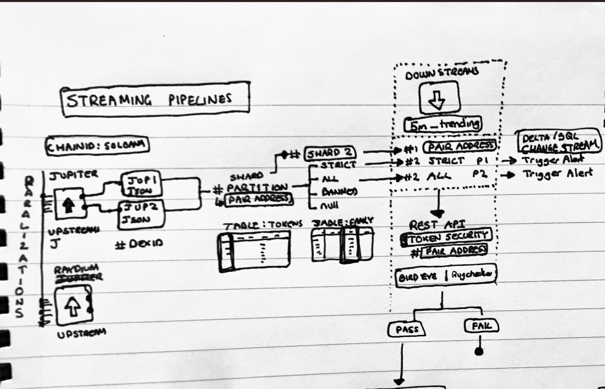

### Timeplus Enterprise Data Stream Processing Architecture
## HOW TO RUN
- Make the `bootstrap_infrastructures.sh` script executable by `sudo chmod +x bootstrap_infrastructures.sh`
- Run it `./bootstrap_infrastructures.sh`
- The script:
    -   Downloads the mentioned version on timeplus enterprise and starts its services after extraction
    -   Creates a local python environment to create infrastructures and feed data based on src/builders/
- Thus, we will have created:
    -   A running version of timeplus enterprise binary
    -   A jupiter token lookup stream named: `jupiter_tokens` where the column `jup_token_type` shows one of [strict, all, banned]
    -   `jupiter_tokens` is a `MATERIALIZED VIEW` based on two `MUTABLE STREAM`s and thus inherently sharded by `jup_token_type`, and we further partition it based on `address`
    -   When this table is joined with the trending table from redpanda stream using `ASOF JOIN`, it only uses the latest values.
    -   **Feature** A token which is strict always remains strict

#### 1. Objective

Design a detailed architecture for processing and analyzing incoming data streams using the Timeplus enterprise. This architecture outlines the technical components and processes required for efficient data handling, transformation, validation, enrichment and meet objective.

#### 2. Requirements

**Functional Requirements:**

- **Data Ingestion:** Real-time data ingestion from Redpanda Trending.
- **Token Lookup:** Categorize data using Jupiter Token Lookup with ALL and STRICT criteria.
- **Data Enrichment:** Use UDFs to fetch security details from BirdEye API based on specific conditions
- **Data Filtering:** Apply business logic to filter data.
- **Downstream** Setup downstream with materialized views.

**Non-Functional Requirements:**

- **Scalability:** Handle increasing data volumes and velocities.
- **Reliability:** Ensure data integrity and availability.
- **Performance:** Process data with low latency.
- **Security:** Implement data encryption and access control.

#### 3. Architectural Design

**3.1 Data Flow Diagram**

1. **Redpanda Trending:** Source of real-time data streams.
2. **Jupiter Token Lookup:** Categorizes data based on ALL or STRICT criteria.
3. **Trending Categorized:** Materialized view of categorized data.
4. **UDF with BirdEye API:** Enriches data from birdeye apis based on some condition.
5. **Enriched Trending:** Materialized view of enriched data.
6. **Business Logic Filter:** Filters data based on business rules.
7. **Downstream:** Final processed data output as a materialized view.

**3.3 Component Details**

**Data Ingestion:**

- **Components:** 5M Trending, Redpanda.
- **Responsibilities:** 
  - Collect and buffer data.
  - Ensure reliable delivery to Jupiter Token Lookup.

**Token Lookup:**

- **Components:** Jupiter Token Lookup.
- **Responsibilities:** 
  - Categorize data using ALL and STRICT criteria.
  - Output materialized view (Trending Categorized).

**Data Enrichment:**

- **Components:** UDF, BirdEye API.
- **Responsibilities:** 
  - Checks a certain condition like: (rank < 20)
  - Call the udf which enriches with response from Birdeye API
  - Output materialized view (Enriched Trending).

**Data Filtering:**

- **Components:** Business Logic Filter.
- **Responsibilities:** 
  - Apply business logic to filter data.
  - Output filtered data as a materialized view.

**Downstream**

- **Components:** Distributed databases, materialized views.
- **Responsibilities:** 
  - Store processed data
  - Enable low-latency retrieval

### Implementation Steps

1. **Planning and Design:** Define use cases, requirements, and architecture.
2. **Development:** 
   - Configure Redpanda, Kafka, and sharding
   - Implement Jupiter Token Lookup
   - Develop UDFs, integrate BirdEye API
   - Set up security checks, business logic filters, and distributed databases
3. **Deployment:** Test in staging, then deploy to production.

## STATUS QUO AND CURRENT BLOCKER

